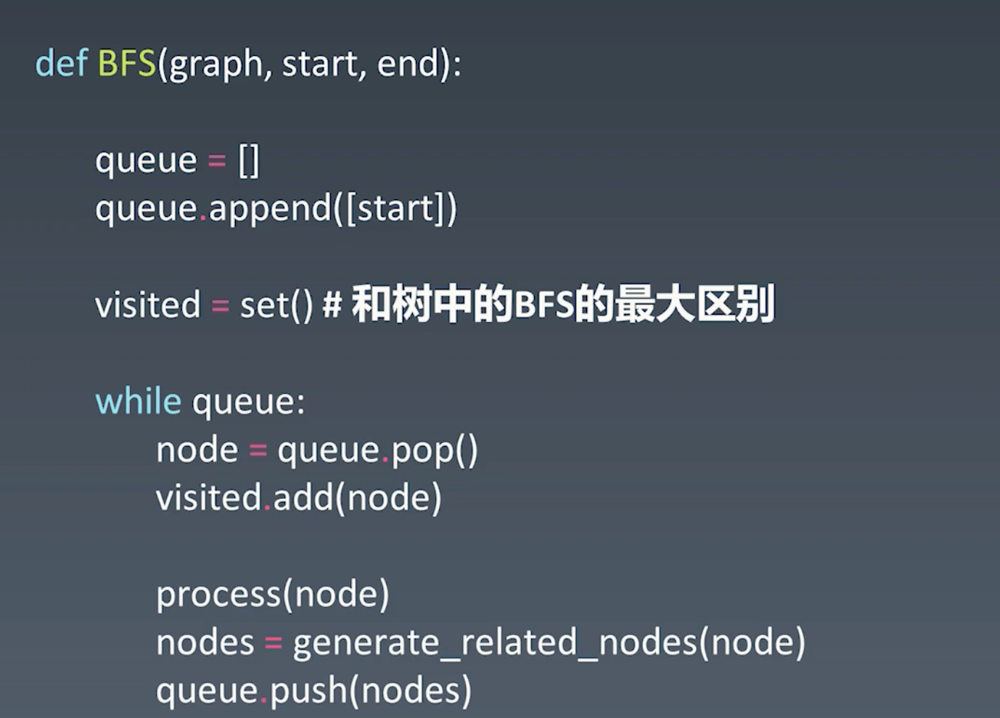

# 一、树
链表是特殊的树
树是特殊的图
树的遍历分为
1. 前序遍历
中-左-右
2. 中序遍历
左-中-右
3. 后续遍历
左-右-中
以上算法都是**O(n)**
***注意递归遍历并不一定会导致效率问题，而要看具体的写法,比如在fabonacci中没有存储中间结果
每次都算一遍，就会导致时间复杂度增高***
现代编译器解决问题 
开栈 
尾递归优化 
有两种方式实现，一种是递归的方法，一种是非递归的方法
非递归的方法在思考循环终止条件的时候。要判断stack是空并且root是null

## 二叉树 
只有连个儿子节点的树 

## 二叉搜索树
### 搜索
左儿子小于根节点 右儿子大于根节点
logn的
### 插入( log(n) )
### 删除
如果删除的是叶子节点就直接删除
# 二、堆
堆的功能是可以找出最大值和最小值
常用堆是二叉堆或者是fabonacci堆
findmax O(1)
deleteMaxO(Logn)
insert or create O(logn) fabonacci堆是O(1)
一般工业级的堆都是严格的fabonacci堆的

堆是完全二叉树实现的
### 什么是大顶堆
完全二叉树 

节点大于子节点

### HeapfyUp
O(logn)
### HeapFyDown
O(logn)
java 中的priority_queue

# 三、图

## Graph<V,E>
### vertex
入度 出度 
### Edge
方向
权重

无向无权图
无向有权图
有向无权重
有向有权图

遍历
dfs
bfs
图的遍历与树的遍历最大的区别就是图的遍历要有visited集合，因为图有可能会遇到已经遍历过的点而树不会
```$xslt
```

代码模板一定要背下来



连通图个数
拓扑排序
最短树 dijkstra
最小生成树

练习
堆的代码
滑动窗口
双端队列法
priorityQueue方法
topk问题


